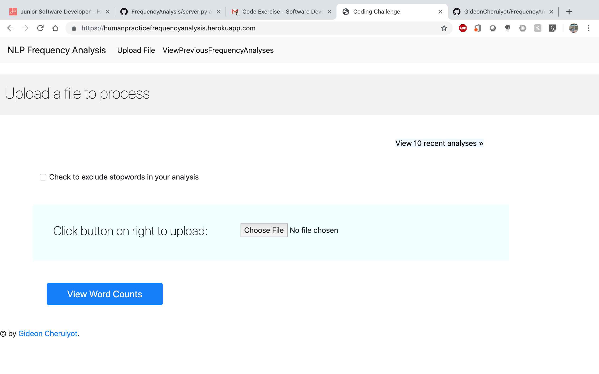
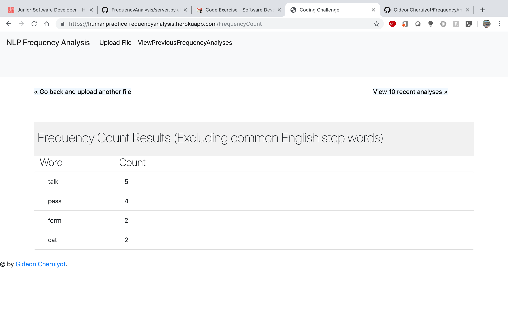
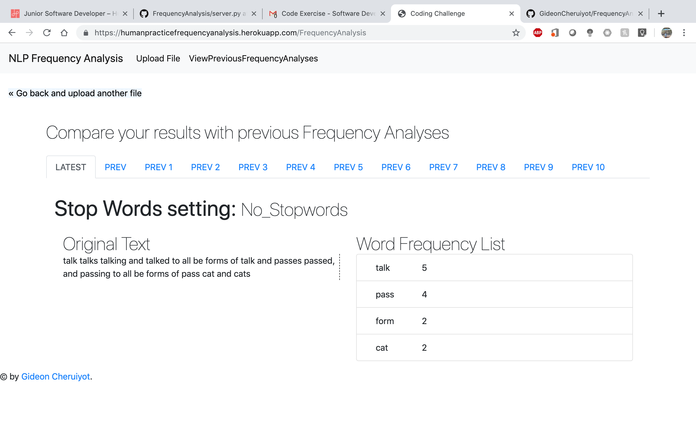

# NLP Frequency Analysis

NLP Frequency Analysis is a web application that a user to upload a file and view how often the most frequent 25 words are used in it. The user can also analyse the previous ten submissions with frequency analyses data (original text, stop words setting, and resulting word frequencies).

# Overview
NLP Frequency Analysis switch between the FrequencyCount view and FrequencyAnalysis view using a navigation bar. On the FrequencyCount Tab, they can upload a file and then process it to view the 25 most frequent words with their counts, excluding stopwords. On the Frequency Analysis Tab, they can switch in between several menus displaying the ten most recent frequency analyses.


## FrequencyCount Page
<br><br>
## Word frequencies
<br><br>

## FrequencyAnalysis Page
<br><br>


# How to run
First, install all the requirements needed from the requirements.txt file


```python
pip install -r requirements.txt
```

Then run:

```python
python server.py
```

Load your browser and enter the link: 

http://127.0.0.1:5000/FrequencyCount

You can then switch in between the tabs

#  Libraries/frameworks you used


:+1:  **_ _Ready!!_ to process some files**  :shipit:

